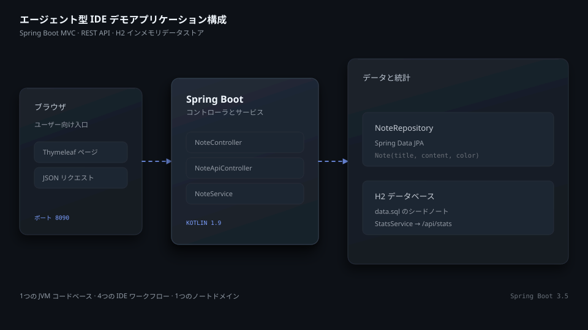
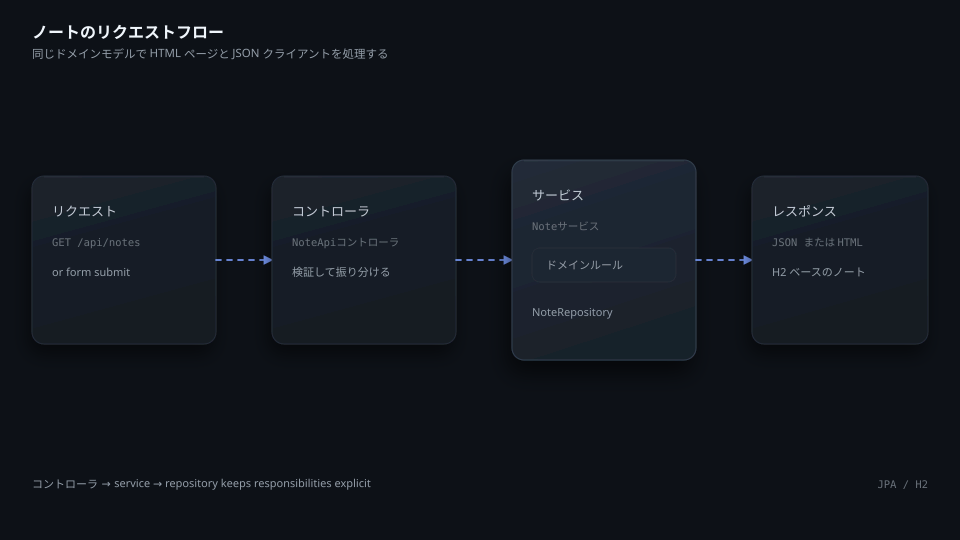
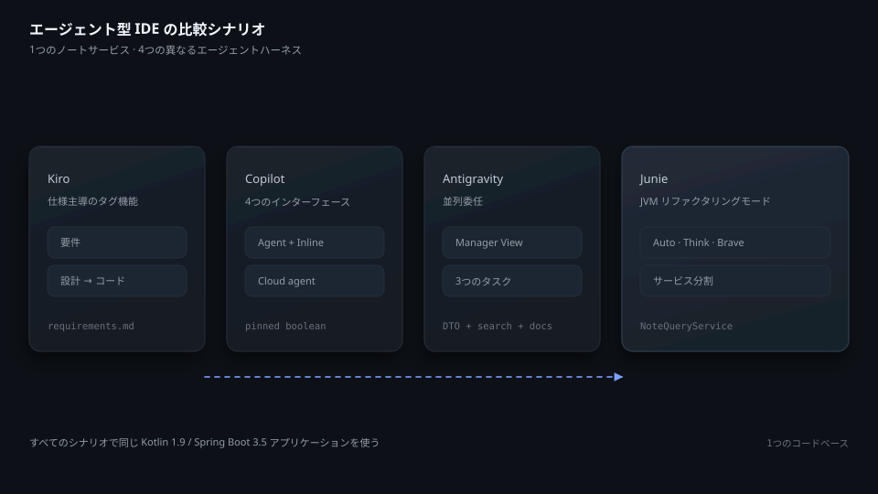
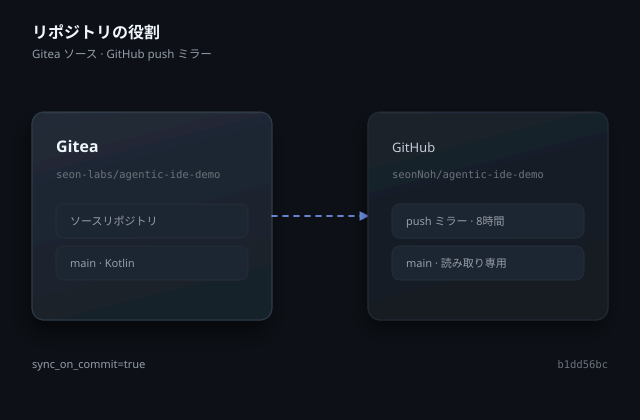

# agentic-ide-demo

[English](README.md) | [한국어](README.ko.md) | [日本語](README.ja.md)

## 概要

`agentic-ide-demo` は、同じ JVM コードベースで4つのエージェント型 IDE を比較する Kotlin・Spring Boot アプリケーションだ。ノートサービスには Thymeleaf のダッシュボードと JSON API がある。データは H2 インメモリデータベースに保存し、統計エンドポイントも提供する。比較シナリオを実行する発表用スクリプトも収録している。

使用技術は次のとおりだ。

- Kotlin 1.9、Java 21
- Spring Boot 3.5、Spring Data JPA
- Thymeleaf、H2、Gradle Kotlin DSL、JUnit 5

比較対象は次の4つである。

- Kiro
- VS Code の GitHub Copilot
- Google Antigravity
- JetBrains Junie



## リポジトリ構成

```text
src/main/kotlin/com/seonology/demo/
  AgenticIdeDemoApplication.kt
  note/   # entity, repository, service, Thymeleaf controller, REST controller
  stats/  # statistics service and JSON controller
src/main/resources/
  application.properties
  data.sql
  templates/  # index, new, detail, and shared header
src/test/kotlin/com/seonology/demo/
  AgenticIdeDemoApplicationTests.kt
  note/  # REST and service tests
```

## すぐに始める

リポジトリをクローンして作業ディレクトリへ移動する。

```bash
git clone https://git.seonology.com/seon-labs/agentic-ide-demo.git
cd agentic-ide-demo
```

Gradle Wrapper でアプリケーションを起動する。

```bash
./gradlew bootRun
```

自動テストを実行する。

```bash
./gradlew test
```

サーバーは `http://localhost:8090` で待ち受ける。ダッシュボードは `/`、ノート作成画面は `/notes/new`、REST コレクションは `/api/notes`、統計情報は `/api/stats`、H2 コンソールは `/h2-console` で利用できる。H2 コンソールの JDBC URL は `jdbc:h2:mem:notes` だ。

## アプリケーション構成



`AgenticIdeDemoApplication` が Spring Boot を起動する。`NoteService` は `NoteRepository` を通じてノートの作成、参照、更新、削除を担当する。`NoteController` は Thymeleaf ページを描画し、`NoteApiController` は JSON エンドポイントを公開する。`StatsService` はノート数と総単語数を計算して `StatsController` に渡す。

起動時には JPA モデルからデータベースを作成する。`src/main/resources/data.sql` がダッシュボードに表示するサンプルノートを登録する。`spring.jpa.open-in-view=false` により、永続化層へのアクセスをサービス境界内に保つ。

## デモシナリオ



スクリプトでは同じアプリケーションを使って4つの作業方法を比較する。

- Kiro: タグ機能を仕様主導で追加する流れ
- GitHub Copilot: 1つの作業で Agent mode、Inline、Next Edit Suggestions、Cloud agent を組み合わせる流れ
- Google Antigravity: Manager View から独立した3つの変更を委任する流れ
- JetBrains Junie: Auto、Think、Brave の各モードで同じリファクタリングを比較する流れ

スクリプトには、4つのツールで共通して行うお気に入り機能の課題と評価表も含まれる。そのまま使えるプロンプトは [DEMO.ko.md](DEMO.ko.md) または [DEMO.ja.md](DEMO.ja.md) にある。

## HTTP エンドポイント

| Method | Path | Purpose |
| --- | --- | --- |
| `GET` | `/` | ノートダッシュボードを描画 |
| `GET` | `/notes/new` | ノート入力画面を描画 |
| `POST` | `/notes` | ノートを作成してダッシュボードへ戻る |
| `GET` | `/notes/{id}` | 1件のノートを描画 |
| `GET` | `/api/notes` | すべてのノートを JSON で返す |
| `GET` | `/api/notes/{id}` | 1件のノートを JSON で返す |
| `POST` | `/api/notes` | JSON からノートを作成 |
| `PUT` | `/api/notes/{id}` | JSON からノートを更新 |
| `DELETE` | `/api/notes/{id}` | ノートを削除 |
| `GET` | `/api/stats` | ノート数と単語数を返す |

## GitHub と Gitea



ソースリポジトリは `https://git.seonology.com/seon-labs/agentic-ide-demo` だ。GitHub の `https://github.com/seonNoh/agentic-ide-demo` は読み取り専用の push ミラーとして維持する。両方のリポジトリで `main` ブランチは現在コミット `b1dd56bc2045d54a4f1af43958753843e38be883` を指し、タグはない。

## 運用

Gradle は Maven Central から宣言済みの依存関係を取得する。アプリケーションは H2 インメモリデータベースを使うため、プロセスを再起動するとシードデータが戻る。実行中のサーバーは `Ctrl+C` で停止し、変更を共有する前に `./gradlew test` を実行する。

## 関連資料

- [DEMO.ko.md](DEMO.ko.md) — そのまま使える韓国語の発表用スクリプト
- [DEMO.ja.md](DEMO.ja.md) — そのまま使える日本語の発表用スクリプト
- [Spring Boot documentation](https://docs.spring.io/spring-boot/)
- [Kotlin documentation](https://kotlinlang.org/docs/home.html)
- [Gradle Kotlin DSL documentation](https://docs.gradle.org/current/userguide/kotlin_dsl.html)
