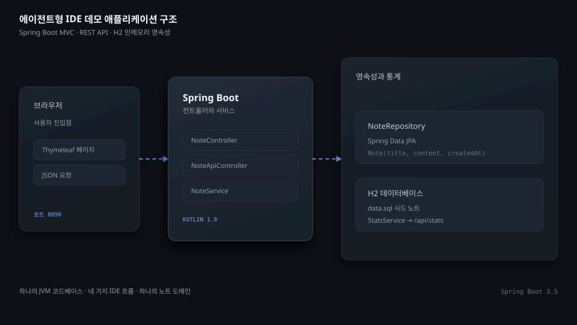
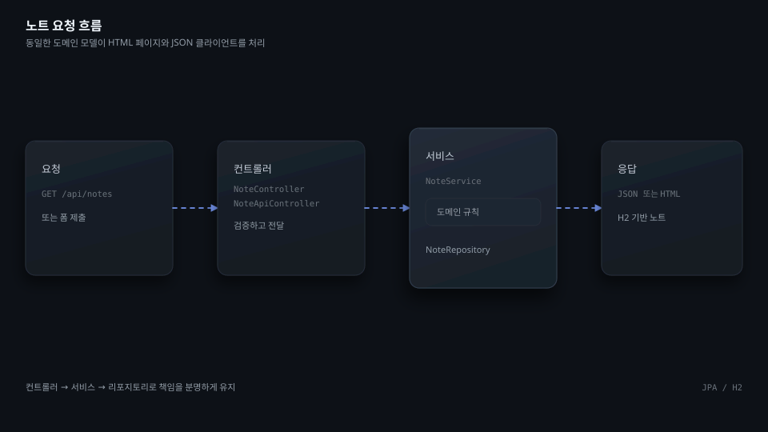
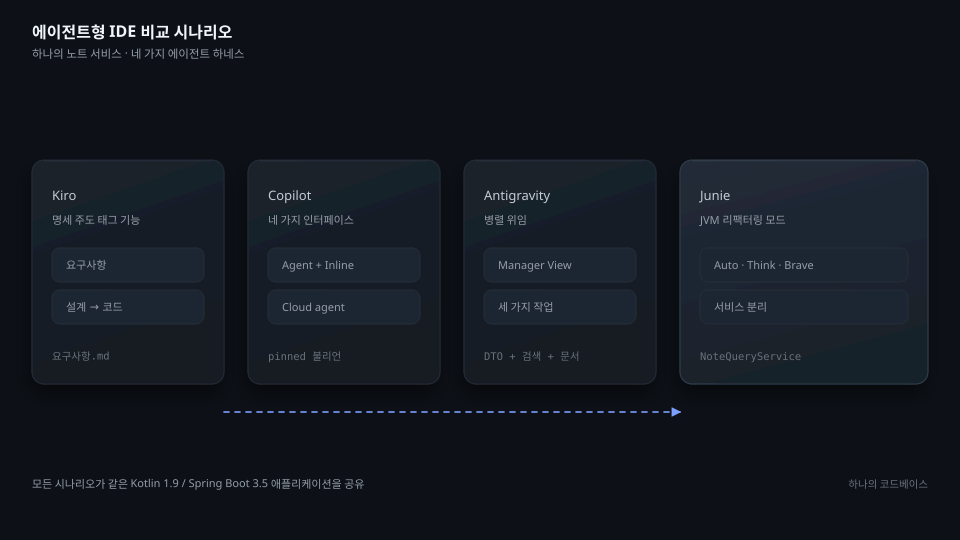
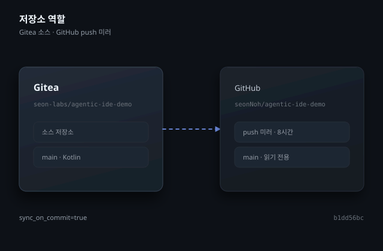

# agentic-ide-demo

[English](README.md) | [한국어](README.ko.md) | [日本語](README.ja.md)

## 개요

`agentic-ide-demo`는 동일한 Java 가상 머신(JVM) 코드베이스를 대상으로 네 가지 에이전트형 IDE를 비교하는 Kotlin·Spring Boot 애플리케이션이다. Thymeleaf 대시보드, JSON API, H2 인메모리 데이터베이스, 통계 엔드포인트로 구성된 노트 서비스를 제공하며, 비교 시나리오를 실행하는 발표 스크립트도 포함한다.

애플리케이션은 Kotlin 1.9, Java 21, Spring Boot 3.5, Spring Data JPA, Thymeleaf, H2, Gradle Kotlin DSL, JUnit 5를 사용한다. 비교 대상은 Kiro, VS Code의 GitHub Copilot, Google Antigravity, JetBrains Junie다.



## 저장소 구조

```text
src/main/kotlin/com/seonology/demo/
  AgenticIdeDemoApplication.kt
  note/   # entity, repository, service, Thymeleaf controller, REST controller
  stats/  # statistics service and JSON controller
src/main/resources/
  application.properties
  data.sql
  templates/  # index, new, detail, and shared header
src/test/kotlin/com/seonology/demo/
  AgenticIdeDemoApplicationTests.kt
  note/  # REST and service tests
```

## 빠른 시작

Java 21과 Git이 필요하다. 두 도구를 확인한 다음 저장소를 복제하고 작업 디렉터리로 이동한다.

```bash
java -version
git --version
git clone https://git.seonology.com/seon-labs/agentic-ide-demo.git
cd agentic-ide-demo
```

Gradle Wrapper로 애플리케이션을 시작한다.

```bash
./gradlew bootRun
```

자동화된 테스트를 실행한다.

```bash
./gradlew test
```

서버는 `http://localhost:8090`에서 요청을 받는다. 대시보드는 `/`, 노트 작성 화면은 `/notes/new`, REST 컬렉션은 `/api/notes`, 통계는 `/api/stats`, H2 콘솔은 `/h2-console`에서 제공한다. H2 콘솔의 JDBC URL은 `jdbc:h2:mem:notes`다.

## 애플리케이션 구조



`AgenticIdeDemoApplication`이 Spring Boot를 시작한다. `NoteService`는 `NoteRepository`를 통해 노트 생성, 조회, 수정, 삭제를 담당한다. `NoteController`는 Thymeleaf 페이지를 렌더링하고, `NoteApiController`는 JSON 엔드포인트를 제공한다. `StatsService`는 전체 노트 수(`total`), 오늘 작성한 노트 수(`today`), 색상별 노트 수(`byColor`)를 `StatsController`에 전달한다.

시작할 때 JPA 모델을 기준으로 데이터베이스를 생성한다. `src/main/resources/data.sql`은 대시보드에 표시할 샘플 노트를 넣는다. `spring.jpa.open-in-view=false` 설정으로 영속성 접근을 서비스 경계 안에 둔다.

## 데모 시나리오



스크립트는 동일한 애플리케이션으로 네 가지 작업 방식을 비교한다.

- Kiro: 태그 기능을 명세 주도로 추가하는 흐름
- GitHub Copilot: 하나의 작업에서 Agent mode, Inline, Next Edit Suggestions, Cloud agent를 함께 사용하는 흐름
- Google Antigravity: Manager View에서 서로 독립적인 세 가지 변경을 위임하는 흐름
- JetBrains Junie: Auto, Think, Brave 모드에서 같은 리팩터링을 비교하는 흐름

한 번의 비교에서는 네 도구에 동일한 모델을 사용하므로, 관찰한 차이는 모델 변경이 아니라 모델을 구동하는 도구별 실행 계층인 에이전트 하네스에서 발생한다. 공통 베이스 과제는 여러 파일 편집, 데이터베이스 스키마 변경, 서비스 분리, Thymeleaf UI 변경, 호환성을 깨는 REST API 변경을 다룬다.

스크립트에는 네 도구에 공통으로 적용하는 즐겨찾기 기능 과제와 평가표도 들어 있다. 복사하여 사용할 프롬프트는 [DEMO.ko.md](DEMO.ko.md) 또는 [DEMO.ja.md](DEMO.ja.md)에서 확인한다.

## HTTP 엔드포인트

| Method | Path | Purpose |
| --- | --- | --- |
| `GET` | `/` | 노트 대시보드 렌더링 |
| `GET` | `/notes/new` | 노트 작성 화면 렌더링 |
| `POST` | `/notes` | 노트를 생성하고 대시보드로 이동 |
| `GET` | `/notes/{id}` | 노트 하나를 렌더링 |
| `POST` | `/notes/{id}/delete` | 노트를 삭제하고 대시보드로 이동 |
| `GET` | `/api/notes` | 모든 노트를 JSON으로 반환 |
| `GET` | `/api/notes/{id}` | 노트 하나를 JSON으로 반환 |
| `POST` | `/api/notes` | JSON으로 노트 생성 |
| `PUT` | `/api/notes/{id}` | JSON으로 노트 수정 |
| `DELETE` | `/api/notes/{id}` | 노트 삭제 |
| `GET` | `/api/stats` | 노트 수를 `total`, `today`, `byColor`로 반환 |

## GitHub와 Gitea



소스 저장소는 `https://git.seonology.com/seon-labs/agentic-ide-demo`다. GitHub의 `https://github.com/seonNoh/agentic-ide-demo`는 읽기 전용 push 미러로 유지한다. push 미러는 `sync_on_commit=true`로 동작하며, 두 원격 저장소의 `main` 브랜치는 동일한 최신 커밋을 가리킨다. 최초 GitHub 원본 기준점은 `b1dd56bc2045d54a4f1af43958753843e38be883`이다.

이관 당시 GitHub에는 `workflows=0`, `runs=0`, `secrets=0`, `variables=0`, `environments=0`으로 확인되었고, 두 저장소 모두 `tags=0`이었다. 이 저장소에서는 Gitea Actions를 비활성화했다.

## 운영

Gradle은 Maven Central에서 선언된 의존성을 받는다. 애플리케이션은 H2 인메모리 데이터베이스를 사용하므로 프로세스를 다시 시작하면 시드 데이터가 복원된다. 실행 중인 서버는 `Ctrl+C`로 중지하고, 변경 사항을 공유하기 전에 `./gradlew test`를 실행한다.

## 관련 자료

- [DEMO.ko.md](DEMO.ko.md) — 복사하여 사용할 수 있는 한국어 발표 스크립트
- [DEMO.ja.md](DEMO.ja.md) — 복사하여 사용할 수 있는 일본어 발표 스크립트
- [원본 영어 README](docs/README.original.en.md) — 바이트 단위로 보존한 원본 문서
- [기여 가이드](CONTRIBUTING.md) — 기여와 검토 절차
- [Gitea Issues](https://git.seonology.com/seon-labs/agentic-ide-demo/issues) — 질문과 문제 제보
- [Spring Boot documentation](https://docs.spring.io/spring-boot/)
- [Kotlin documentation](https://kotlinlang.org/docs/home.html)
- [Gradle Kotlin DSL documentation](https://docs.gradle.org/current/userguide/kotlin_dsl.html)
