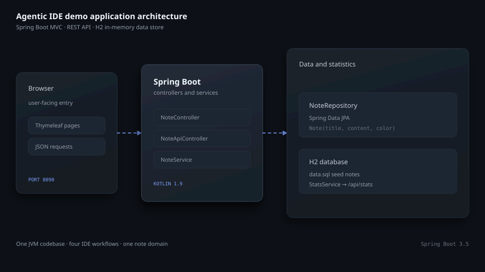
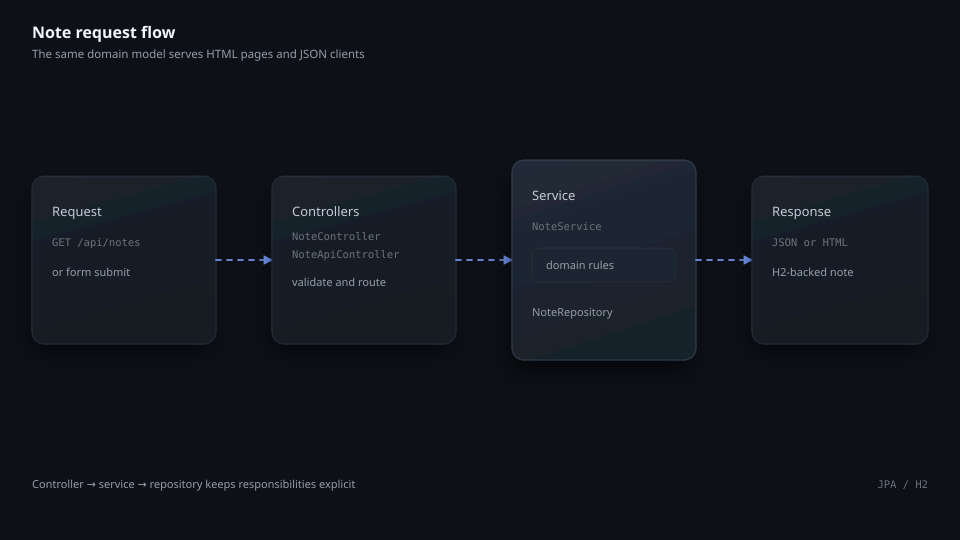
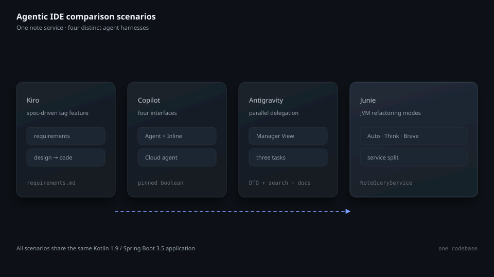
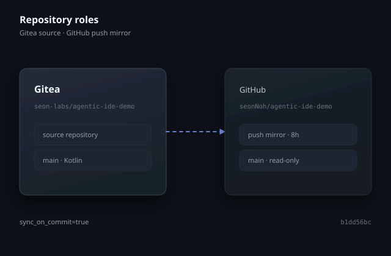

# agentic-ide-demo

[English](README.md) | [한국어](README.ko.md) | [日本語](README.ja.md)

## Overview

`agentic-ide-demo` is a small Kotlin and Spring Boot application for comparing four agentic IDEs against the same Java Virtual Machine (JVM) codebase. It models a note service with a Thymeleaf dashboard, a JSON API, an H2 in-memory database, and a statistics endpoint. The repository also contains the presentation scripts used to run the comparison scenarios.

The application uses Kotlin 1.9, Java 21, Spring Boot 3.5, Spring Data JPA, Thymeleaf, H2, Gradle Kotlin DSL, and JUnit 5. The four comparison targets are Kiro, GitHub Copilot in VS Code, Google Antigravity, and JetBrains Junie.



## Repository layout

```text
src/main/kotlin/com/seonology/demo/
  AgenticIdeDemoApplication.kt
  note/   # entity, repository, service, Thymeleaf controller, REST controller
  stats/  # statistics service and JSON controller
src/main/resources/
  application.properties
  data.sql
  templates/  # index, new, detail, and shared header
src/test/kotlin/com/seonology/demo/
  AgenticIdeDemoApplicationTests.kt
  note/  # REST and service tests
```

## Quick start

Java 21 and Git are required. Confirm both tools, then clone the repository and enter the working tree.

```bash
java -version
git --version
git clone https://git.seonology.com/seon-labs/agentic-ide-demo.git
cd agentic-ide-demo
```

Start the application with the Gradle Wrapper.

```bash
./gradlew bootRun
```

Run the automated tests.

```bash
./gradlew test
```

The server listens on `http://localhost:8090`. The dashboard is available at `/`, note creation at `/notes/new`, the REST collection at `/api/notes`, statistics at `/api/stats`, and the H2 console at `/h2-console` with JDBC URL `jdbc:h2:mem:notes`.

## Application structure



`AgenticIdeDemoApplication` starts Spring Boot. `NoteService` owns note creation, lookup, update, and deletion through `NoteRepository`. `NoteController` renders Thymeleaf pages, while `NoteApiController` exposes JSON endpoints. `StatsService` returns the total note count (`total`), notes created today (`today`), and counts grouped by color (`byColor`) to `StatsController`.

The database is created from the JPA model at startup. `src/main/resources/data.sql` supplies the sample notes that appear in the dashboard. `spring.jpa.open-in-view=false` keeps persistence access inside the service boundary.

## Demo scenarios



The scripts use the same application to compare four workflows:

- Kiro: specification-driven work for a tag feature.
- GitHub Copilot: Agent mode, Inline, Next Edit Suggestions, and Cloud agent in one task.
- Google Antigravity: three independent changes delegated through Manager View.
- JetBrains Junie: the same refactoring task in Auto, Think, and Brave modes.

All four tools use the same model during a comparison run, so the observed differences reflect the agent harness rather than a model change. The shared base exercises multi-file editing, a database schema change, service splitting, a Thymeleaf UI change, and a breaking REST API change.

The scripts also define a shared favorite-feature exercise and a small evaluation sheet. Read [DEMO.ko.md](DEMO.ko.md) or [DEMO.ja.md](DEMO.ja.md) for the copy-ready prompts.

## HTTP endpoints

| Method | Path | Purpose |
| --- | --- | --- |
| `GET` | `/` | Render the note dashboard |
| `GET` | `/notes/new` | Render the note form |
| `POST` | `/notes` | Create a note and return to the dashboard |
| `GET` | `/notes/{id}` | Render one note |
| `POST` | `/notes/{id}/delete` | Delete a note and return to the dashboard |
| `GET` | `/api/notes` | Return all notes as JSON |
| `GET` | `/api/notes/{id}` | Return one note as JSON |
| `POST` | `/api/notes` | Create a note from JSON |
| `PUT` | `/api/notes/{id}` | Update a note from JSON |
| `DELETE` | `/api/notes/{id}` | Delete a note |
| `GET` | `/api/stats` | Return `total`, `today`, and `byColor` note counts |

## GitHub and Gitea



The source repository is `https://git.seonology.com/seon-labs/agentic-ide-demo`. GitHub remains available at `https://github.com/seonNoh/agentic-ide-demo` as the read-only push mirror. The push mirror uses `sync_on_commit=true`, and the `main` branches on both remotes point to the same current commit. The initial GitHub source baseline was `b1dd56bc2045d54a4f1af43958753843e38be883`.

At migration capture, GitHub reported `workflows=0`, `runs=0`, `secrets=0`, `variables=0`, and `environments=0`; both repositories had `tags=0`. Gitea Actions is disabled for this repository.

## Operations

Gradle resolves the declared dependencies from Maven Central. The application uses an in-memory H2 database, so restarting the process restores the seed data. Stop a running server with `Ctrl+C`, then use `./gradlew test` before sharing a change.

## Related

- [DEMO.ko.md](DEMO.ko.md) — copy-ready Korean presentation script.
- [DEMO.ja.md](DEMO.ja.md) — copy-ready Japanese presentation script.
- [Original English README](docs/README.original.en.md) — byte-preserved source documentation.
- [Contributing guide](CONTRIBUTING.md) — contribution and review process.
- [Gitea Issues](https://git.seonology.com/seon-labs/agentic-ide-demo/issues) — questions and problem reports.
- [Spring Boot documentation](https://docs.spring.io/spring-boot/)
- [Kotlin documentation](https://kotlinlang.org/docs/home.html)
- [Gradle Kotlin DSL documentation](https://docs.gradle.org/current/userguide/kotlin_dsl.html)
